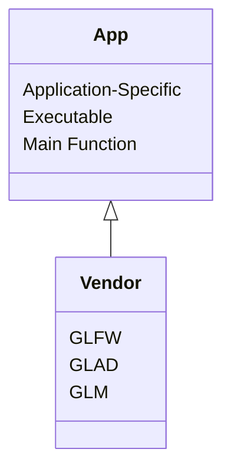

# cpp-opengl-glfw-glad-cmake
## Bocan Online C++ OpenGL Template

Template for C++ projects with cross-platform Graphical User Interface (GUI) 
implemented using OpenGL, GLFW, and GLAD, imported and built using CMake.

### Overview

This repository is primarily a CMake template and a code reference for setting 
up OpenGL projects using GLFW, GLAD, and GLM. 

Inspiration for this project started with this demonstration by 
[onlyfastcode](https://www.youtube.com/watch?v=dA991DBSZh4). I referenced 
TheCherno's [OpenGL Series](https://youtube.com/playlist?list=PLlrATfBNZ98foTJPJ_Ev03o2oq3-GGOS2&si=tBsiXclFn_QX6l1E) 
to learn more about OpenGL and modifying the OpenGL portion.

### Architecture

This particular application does not use a static library. All functions
and modules used can be found in the main.cpp file. The main.cpp has comments to
show which part of the program is doing what, what functions are being called, 
libraries being used, etc. I deliberately chose not to abstract away very much
to demonstrate the various OpenGL and GLFW functions.



### Directory Structure

```
./
├── CMakeLists.txt
├── CMakePresets.json
├── LICENSE.md
├── README.md
├── docs/
├── scripts/
│   ├── build-clean.sh*
│   ├── build-debug.sh*
│   ├── build-release.sh*
│   ├── run-debug.sh*
│   ├── run-release.sh*
│   └── run-test.sh*
├── source/
│   ├── OpenGLTemplate-App/
│   │   ├── CMakeLists.txt
│   │   ├── source/
│   │   │   └── main.cpp
│   │   └── vendor/
│   └── OpenGLTemplate-Core/
│       ├── CMakeLists.txt
│       ├── source/
│       └── vendor/
├── test/
└── vendor/
    ├── CMakeLists.txt
    ├── glad/
    │   └── CMakeLists.txt
    ├── glfw/
    │   └── CMakeLists.txt
    └── glm/
        └── CMakeLists.txt
```

---

## Using this Template

This template is best used as a CMake template to get the dependencies imported
and linked correctly to begin a new project. It can be used for basic OpenGL 
demonstrations as well.

To begin using this template, the most straightforward method would be to use git
clone to bring the repo contents to your local machine. From there you can test 
the build system, edit the files to match your project name, and start 
developing your project. If you need more than one "Core" or more than one
"App" in your project, you will need to make some edits in the CMakeLists.txt
files and add the respective directory structure.


> [!NOTE]
> Need to Haves:
>
> - Git
> - CMake
> - Make (or your build system of choice)
> - Clang (or your C compiler of choice)


> [!NOTE]
> Nice to Haves:
>
> - tmux
> - tmuxp
> - Bocan Online Developer Toolkit (shameless plug)


### 1. Clone the repository to your desired project directory.

```bash
# from the desired parent directory

git clone https://github.com/BocanOnlineTemplates/cpp-opengl-glfw-glad-cmake
```

### 2. Rename the project.

In the CMakeLists.txt at the root of the project, change the following line to
reflect the name of your project.

```bash
#[[ ../project_root/CMakeLists.txt ]]
#[[ Change 'Template' to your Project Name ]]

project(OpenGLTemplate CXX)
```

You can then edit the Template-App and Template-Core directories and the 
associated files to also match your project name (e.g. NewName-Core and NewName-App).


> [!IMPORTANT] 
> The name of the project in CMake and the names of the project directories (OpenGLTemplate-Core and OpenGLTemplate-App) must match for CMake to build the project properly.


### 3. Build the project.

This template includes helper scripts to build, run, test, and clean the project. 
These scripts can all be ran from the project root. These scripts require CMake 
to be installed as well as your build system of choice (e.g. Make, Ninja, etc.).

```bash
# setup the scripts as executables, you only need to do this once

chmod +x ./scripts/build-clean.sh \
./scripts/build-debug.sh \
./scripts/build-release.sh \
./scripts/run-test.sh \
./scripts/build-run-debug.sh \
./scripts/build-run-release.sh
```

```bash
# run each script from the project directory

./scripts/build-clean.sh        # clean all artifacts and delete build directories 
./scripts/build-debug.sh        # build the debug configuration to build-debug/ 
./scripts/build-release.sh      # build the release configuration to build-release/
./scripts/run-test.sh           # run all registered tests with ctest 
./scripts/run-debug.sh          # run the debug binary 
./scripts/run-release.sh        # run the release binary
```

[//]: # (### 4. Developing.)
[//]: # (## Adding Modules to the Library.)
[//]: # (## Adding Third-Party Libraries.)
[//]: # (## Adding Application-Specific Code.)
[//]: # (### 5. Testing.)
[//]: # (## Registering New Tests.)
[//]: # (### 6. Building.)
[//]: # (## Adding New Binaries -Libraries or Executables-.)
[//]: # (## Adding New Build Configurations.)

---

## Documentation

README.md

[//]: # (TODO: Add link to docs/ root to documentation tree.)


### License

This project is published under The Unlicense. 
The code is public domain; use it however you want. 

Full text in [LICENSE.md](/LICENSE.md)
